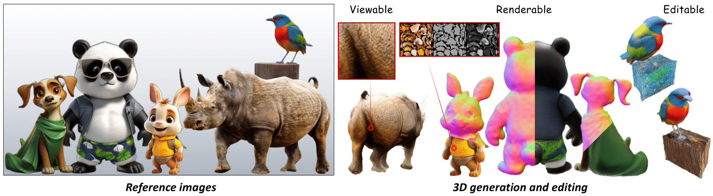

# HyperDreamer (SIGGRAPH Asia 2023)

[**Project page**](https://ys-imtech.github.io/HyperDreamer/) | [**Paper**](https://arxiv.org/abs/2312.04543)

[Tong Wu](https://wutong16.github.io/), [Zhibing Li](https://wutong16.github.io/), [Shuai Yang](https://ys-imtech.github.io/), [Pan Zhang](https://panzhang0212.github.io/), [Xingang Pan](https://xingangpan.github.io/), [Jiaqi Wang](https://myownskyw7.github.io/), [Dahua Lin](http://dahua.me/), [Ziwei Liu](https://liuziwei7.github.io/)

Official implementation of HyperDreamer: Hyper-Realistic 3D Content Generation and Editing from a Single Image



## Installation

### Install Dependencies:

- Install `PyTorch >= 1.12`. We have tested on `torch1.12.1+cu113`, but other versions should also work fine.
```sh
# torch1.12.1+cu113
pip install torch==1.12.1+cu113 torchvision==0.13.1+cu113 --extra-index-url https://download.pytorch.org/whl/cu113
```

```sh
# install kaolin
pip install kaolin==0.14.0 -f https://nvidia-kaolin.s3.us-east-2.amazonaws.com/torch-1.12.1_cu113.html
```

- Other dependencies:
```sh
pip install -r requirements.txt
pip install ./raymarching
pip install ./shencoder
pip install ./freqencoder
pip install ./gridencoder
```

### Download pretrained models

- **Zero123** for diffusion guidance
```sh
cd pretrained/zero123
wget https://zero123.cs.columbia.edu/assets/zero123-xl.ckpt
```

- **Omnidata** for depth and normal prediction
```sh
mkdir pretrained/omnidata
cd pretrained/omnidata
gdown '1Jrh-bRnJEjyMCS7f-WsaFlccfPjJPPHI&confirm=t' # omnidata_dpt_depth_v2.ckpt
gdown '1wNxVO4vVbDEMEpnAi_jwQObf2MFodcBR&confirm=t' # omnidata_dpt_normal_v2.ckpt
```

- **256 resolution tetrahedron** for DMTet. [Download](https://drive.google.com/file/d/1lgvEKNdsbW5RS4gVxJbgBS4Ac92moGSa/view?usp=sharing) and move it to `tets/`

- **SAM** for segmentation
```sh
mkdir models
cd models
wget https://dl.fbaipublicfiles.com/segment_anything/sam_vit_h_4b8939.pth
```

- **derender3d** for derender
```sh
mkdir models/co3d
wget -O models/co3d/checkpoint010.pth https://www.robots.ox.ac.uk/~vgg/research/derender3d/data/co3d.pth
```

- **PASD** for super-resolution module
  - Download SD1.5 models from [huggingface](https://huggingface.co/runwayml/stable-diffusion-v1-5) and put them into `PASD/checkpoints/stable-diffusion-v1-5`
  - Download PASD pre-trained models [pasd](https://public-vigen-video.oss-cn-shanghai.aliyuncs.com/robin/models/PASD/pasd.zip) and place the dictionary `checkpoint-100000` inside `PASD/runs/pasd/`.


- **Editing** for editing (ControlNet-Normal2img)

1) You can download `control_v11p_sd15_normalbae.pth` and `control_v11p_sd15_normalbae.yaml` from the [HuggingFace Model Page](https://huggingface.co/lllyasviel/ControlNet-v1-1/tree/main), and put it under `pretrained/controlnet/...`.

2) You need to download Stable Diffusion 1.5 model ["v1-5-pruned.ckpt"](https://huggingface.co/runwayml/stable-diffusion-v1-5/tree/main) and put it under `pretrained/controlnet/...`.


## Quickstart
 
Preprocess the input image to move background and obtain its depth, normal and caption.
```sh
python preprocess_image.py /path/to/image.png
```

We adopt a two-stage training pipeline. You can run it by
```sh
image_path='data/strawberry_rgba.png'
nerf_workspace='exp/strawberry_s1'
dmtet_workspace='exp/strawberry_s2'

# Stage 1: NeRF
bash run_nerf.sh ${image_path} ${nerf_workspace}

# Stage 2 DMTet
bash run_dmtet.sh ${image_path} ${nerf_workspace} ${dmtet_workspace}
```

[optional] We also support importiing pre-defined material masks in the reference view. You can use [Semantic-SAM](https://github.com/UX-Decoder/Semantic-SAM) or [Materialistic](https://github.com/prafull7/materialistic) to obtain more accurate masks.
```sh
bash run_dmtet.sh ${image_path} ${nerf_workspace} ${dmtet_workspace} --material_masks material_masks/xxx.npy
```

To relight
```sh
bash run_dmtet.sh ${image_path} ${nerf_workspace} ${dmtet_workspace} --test --relight_sg envmaps/lgtSGs_studio.npy
```

To editing
```sh
python editing/scripts/run_editing.py --config_path=editing/configs/sculpture.yaml
```

Gradio Demo (Editing)
```sh
python editing/app_edit.py
```
## TODO

- [x] Release editing code.

## Acknowledgement

This code is built on the open-source projects [stable-dreamfusion](https://github.com/ashawkey/stable-dreamfusion), [Zero123](https://github.com/cvlab-columbia/zero123), [derender3d](https://github.com/Brummi/derender3d), [SAM](https://github.com/facebookresearch/segment-anything) and [PASD](https://github.com/yangxy/PASD).

Thanks to the maintainers of these projects for their contribution to the community!

## Citation

If you find HyperDreamer helpful for your research, please cite:
```bibtex
@InProceedings{wu2023hyperdreamer,
  author = {Tong Wu and Zhibing Li and Shuai Yang and Pan Zhang and Xingang Pan and Jiaqi Wang and Dahua Lin and Ziwei Liu},
  title = {HyperDreamer: Hyper-Realistic 3D Content Generation and Editing from a Single Image},
  journal={ACM SIGGRAPH Asia 2023 Conference Proceedings},
  year={2023}
}
```
